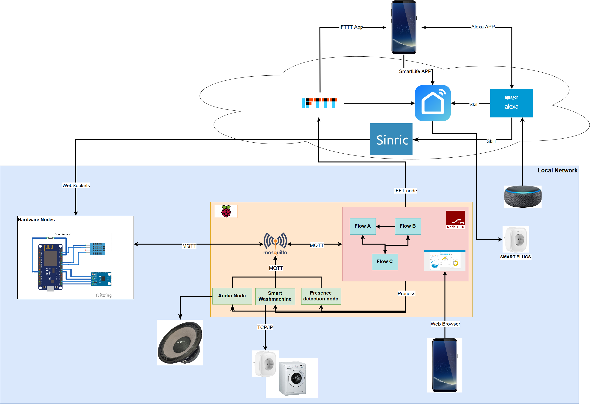
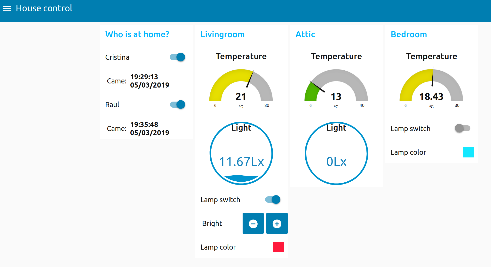
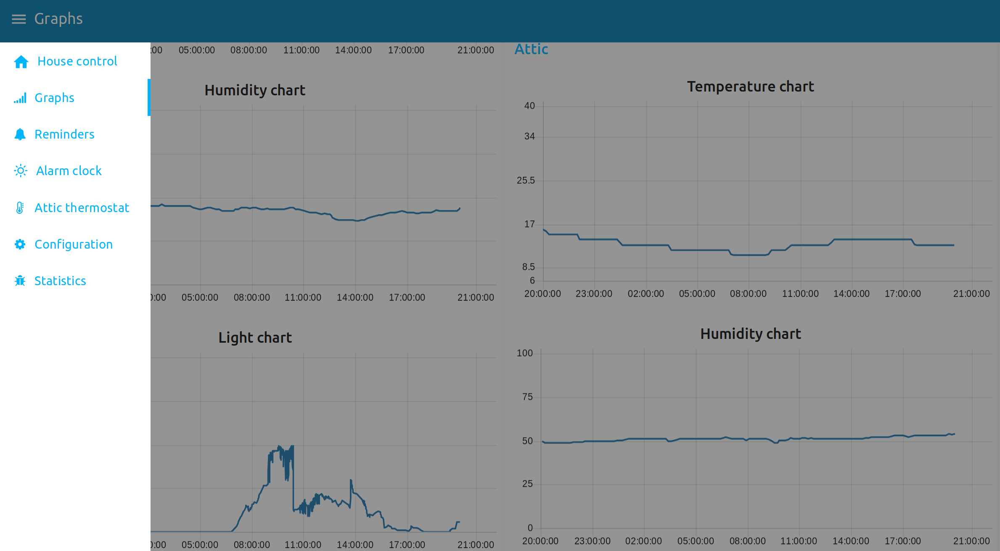

# Home automation project
## Improvements since v1.0
* Restructured Dashboard.
* Fixed minor bugs in Node-Red.
* Improved synchronization between the physical nodes and the displayed status in the Dashboard.
* Added Alexa node (running as service in the Raspberry Pi) to replace Sinric in the microcontrollers.
* Added OTA update support to all the nodes.
* Removed balcony node.
* Livingroom node takes over the balcony door open detection. It does no longer control the livingroom lights.
* New Terrace node for monitoring temperature, humidity and light of the terrace. Controls a LED stripe for terrace lightning.
* Bedroom node upgraded to ESP32. It controls directly a LED stripe for bedroom lightning (instead of IR). Added feature to monitor the status of the bedroom window.
* Extended audio node to support guest messages. The generic messages are customized with the guest name when the feature is properly configured in the Dashboard.
* Improved reminder concept. Each reminder can be configured to be triggered with an exit event, a good night event, or both. The reminders can be switched off from Alexa (all together).

## Introduction
I started this project to create a solution to a lazy problem: my washing machine is in my basement and I live on the third floor.
Things get tricky when you buy the cheapest washing machine on the market and the washing time depends on many many factors, so you will most likely go to pick the laundry up and it would still be working... It would be great if I just could get a notification when it is done...
After thinking a little bit on how to solve this problem while having fun, a lot of additional use-cases came to my mind:
* what if I could also switch a lamp ON when the washing machine is done?
* what if I could remind me to pick it up when I leave my apartment?
* what if I could just connect anything with anything and make it do what I want when I want?

So I just decided to make my washing machine solution a feature within many others of a full home automation project.

The first thing you think when you want to start your own home automation project is: let's just buy some commercial products like Alexa, Hue...
This would work if you want an out-of-the-box solution to control some things with your voice or a 3rd party app, but this brings some not so funny implications:
 * What if your internet connection is gone? All these smart devices communicate with each other though the cloud.
 * What if you want that some "events" at your home trigger an action? The Alexa start point for all it's actions is a voice request (or pre-programmed events like reminders, alarms...).
 * What if you don't find in the market a smart device that does exactly what you want?
 * What if you find it, but it costs you half a salary?
 * What if you find it, it is cheap, but has no plug&play interface with your other smart devices?

It would be great to have a smart home that meets the following requirements:
 * All (or almost all) features work on the local network. No dependency on Internet connection.
 * I control what is sent/received by each device, and only I use this information.
 * All devices can talk to each other.
 * It is easy to add a new device to the network.
 * Every thing is based on open source standard technologies, with a great community and widely used.
 * It is fun to develop and use!

So let's go for it!

## Project overview
The brain of the project is going to be Node-Red (https://nodered.org/), a programming tool for wiring together hardware devices, APIs and online services in new and interesting ways. There are many tutorials online showing how to get started with it.
It provides a browser-based editor that makes it easy to wire together flows using the wide range of nodes in the palette that can be deployed with a single click.

The communication protocol used in this project is MQTT. This is one of the most used communication protocols for IoT and is very well integrated in Node-Red.
MQTT implements a publish/subscribe communication pattern that fits perfectly into our needs for the following reasons:
* The clients only need to know the IP address of the broker. This means good scalability without the need of assign fixed IP address to each node/device.
* A node publishes a topic when it has something to “share” to the network. Any device on this network (a physical node or a program running on your laptop) can subscribe to this topic and do something with this information. So anything can talk to anything.
* Any node can publish any topic to the network, so we can easily simulate the behavior of our HW without the need of setting this hardware manually to the desired state.

Of course a network with star topology has also the downsides of a single point of failure, but we can live with that.
For the MQTT broker, we will use Mosquitto (https://mosquitto.org/), very easy to install and connect to Node-Red.
Both Mosquitto and Node-Red will run on a Raspberry Pi 3, together with another scripts, add-ons and virtual nodes of the network.

## The architecture

## The nodes
I define two different type of nodes:
### Hardware nodes
These nodes are implemented with real hardware and deployed throughout the house. All the nodes for my specific use cases and wishes can be found in this repository.

They have been developed based on a template. Follwing this template might not be the most efficient approach for some of the modules, but helps scalability and troubleshooting.

Adding another module to the network would be as easy as filling the template with your needs and put the hardware together (and of course do something with the published information).

### Virtual nodes
These nodes are just a standalone software implementation, some of them with hardware requirements (e.g: Presence detection node needs a bluetooth module).
They can be deployed anywhere as long as the HW requirements are fulfilled and they can connect to the MQTT broker.
Similar to the hardware nodes, the virtual nodes once executed they do their thing and then publish the result in a MQTT message.
As opposite to the hardware nodes, they need to be actively executed to do their thing.

A link to the impelementation of each of these nodes (submodule) can be also found in this repository.

## The functionality
In a few words, the functionality of the smart home is the following: each node does its thing (interaction with the environment) under request (execution, MQTT, Websocket...) and provides a result (MQTT, action...) to be used by anyone who cares.
All the real logic (what to do with this information) is implemented in Node-Red. The nodes only talk to each other through Node-Red.
This abstraction layer allows us to simulate hardware and do small modifications of the algorithms in Node-Red’s web programming interface, what is much easier and faster than flashing the microcontrollers.

There are hundreds of things we can implement with the information and actuators we have. This is just a list of what I have done so far, and I am sure I am forgetting some things:

Feature name |	Feature description	| Involved nodes	| Involved external services |	Comments / Constrains
------------ |------------ |------------ |------------ |------------
Temperature monitoring |	Monitoring and displaying the temperature. It is displayed as current temperature and in a graph, with temperature of the last 24h | Livingroom node. Bedroom node, Attic node, Dashboard | |	Temperature in °C, Range [0,30]
Humidity monitoring	| Monitoring and displaying the humidity. It is displayed as current humidity and in a graph, with measurements of the last 24h | Livingroom node, Bedroom node, Attic node, Dashboard | | Humidity in %. Range [0,100]
Attic heating system | Keep the attic at a constant temperature. The feature can be enabled/disabled via Dashboard. The target temperature can be changed via Dashboard | Attic node, Dashboard | IFTTT, SmartLife | The heaters are controlled by a Smart plug, enabled or disabled via IFTTT Webhooks. Range [0, 30]
Attic smart lightning	| When the attic ladder is open and the attic light level is below a threshold, the attic light will switch on. When the attic ladder is closed, the attic light will switch off. |	Attic node | IFTTT, SmartLife | The lamp is controlled by a Smart plug, enabled or disabled via IFTTT Webhooks. This application might conflict with another attic lightning features (e.g: Alexa).
Presence detection | Detect the presence of the apartment owners and another possible objects (e.g: Car, Guest...). The presence and the arrival/leaving time is displayed in the Dashboard. The arrival and leaving events can be notified in a smartphone via IFTTT push notifications. These events can be used in another features | Presence detection node, Dashboard | IFTTT | For presence detection, each individual or object must carry a Bluetooth beacon tracker (e.g: Tile Mate). The notification is delivered via IFTTT app. To receive an IFTTT notification, each user must have an IFTTT acount and the app installed.
Welcome lightning	| When an entrance is detected and the livingroom light level is below a threshold, the livingroom light will switch on	| Entrance node, Livingroom node | | The lamps that will receive the MQTT message to switch on, are part of another project and not included in this home automation repository. Check https://github.com/rbaltasar/sound_reactive_lamp_slave for more information.
Smart washmachine	| When the washmachine is detected to be runing, the Audio node will let us known. When the washmachine is detected to be finished: a push notification will be sent to the smartphone via IFTTT app and the event will be anounced with voice. The status of the washmachine is displayed in the dashboard. The current consumption of the washmachine is tracked in a dashboard graph | Smart washmachine, Livingroom node, Audio node, Dashboard |IFTTT	| The washmachine is controlled by a Smart plug. It needs to receive the WiFi signal. This application might confligt with the usage of the app SmartLife. This application might conflict with the usage of the Livingroom lamp. The notification is delivered via IFTTT app. To receive an IFTTT notification, each user must have an IFTTT acount and the app installed.
Entrance/Exit greeting | Entrance events will be greeted with voice: with a generic greeting, when a new presence is not detected at the time of the event. With a customized greeting, when a new presence is detected at the time of the event. Exit events will be greeted with voice: with a generic goodbye, when more than one presence is detected at the time of the event. with a customized goodbye, when only one presence is detected at the time of the event. | Presence detection node, Audio node | Google text to speech	| Same comments as the presence detection node. The message will be played in the RaspberryPi (NodeRed host) via a connected speaker.
Guest support | The Guest feature can be enabled by switching it on in the Configuration Dashboard, introducing the name of the Guest and finally pressing the Update button to download all the customized audio files. The Guest will be greeted similarly to the house owners. | Presence detection, Audio node | Google TTS | |
House alarm	| When the alarm is activated and the entrance door is open, an alarm will sound. The alarm can be activated and deactivated via Dashboard. An IFTTT push notification will be sent in case of a triggered alarm | Entrance node, Audio Node, Dashboard |	IFTTT |	Same comments as other features using IFTTT notifications.
Long time door open detection	| When this feature is activated and the door status of a door is open longer than a defined time: a push notification will be sent to the IFTTT app and it will be notified by voice.This feature can be activated/deactivated in the Dashboard. | Entrance node, Balcony node, Audio node, Dashboard | IFTTT | |
Control bedroom lights by clap | The bedroom led lights can be switched on and off by clapping twice |	Bedroom node | | |
Wakeup with dawn simulation |	A wakeup alarm (sound, voice...) can be configured in the Dashboard. When the alarm goes off, the bedroom led lights will change color and brightness, simulating a dawn. Once the dawn has been fully simulated, birds and celestial music will be played. The alarm can be programmed in the Dashboard | Bedroom node, Audio node | |It is not yet possible to snooze this alarm.
Temperature warning	| A big difference of temperature between the Livingroom and the Bedroom will trigger an IFTTT push notification. This issue aims to prevent forgotten open windows in extreme external temperature conditions | Livingroom node, Bedroom node |	IFTTT	| Same comments as other features using IFTTT notifications.
Rain warning | To prevent leaving a window open when rain is forecasted, an IFTTT push notification will be sent if: a window is detected to be open, rain is forecasted for the next hours, an exit event is detected or no presence detected.	| Livingroom node, Presence detection node | IFTTT, OpenWeatherMap |	|
Reminders | Several hard-coded reminders can be enabled/disabled via the Dashboard or, enabled by events (e.g: when the washmachine is finished, then enable the "Pick up laundry" reminder), and disabled from Alexa. There is one "custom" reminder where the reminder text can be introduced in the Dashboard. Each reminder can be configured to be triggered by an exit event or by a goodnight event (triggered by the Alexa node) or both. | Audio Node, Alexa Node | Alexa, Sinric| |

## The Dashboard
Node-Red has the great feature of providing a web-based GUI that can be used to monitor and control the whole system.
You can stick to the few widgets provided by default or create your own ones (I stay with the first option, this is already too much high level for me).

## Future improvements and features
### Improvements
* Improve documentation and detailed descriptions.
* Improve the reminder concept with more flexibility for new/customized reminders.
* Add more functionality with the weather information (reminders, warnings...).
* Add a door sensor to the Bendroom node to detect the status of the window. Add rain warning functionality to this node.
* Add support for deep sleep for all the hardware nodes.
* Replace (where possible and feasible) the IR RGB led bulbs by Led Stripes controlled directly from the microcontroller.
* OTA updates.
* Save microcontroller states in FLASH memory and load them at boot time.
### Features
Feature name |	Feature description	| Involved nodes	| Involved external services |	Comments / Constrains
------------ |------------ |------------ |------------ |------------
Kitchen status monitoring | Monitor the status of the heating plates and the oven. If they are on for a long time, trigger a reminder. If they are on and an exit event is detected, trigger a reminder (and maybe a IFTTT notification) | Kitchen node (new), Audio node | IFTTT | |
Low power consumption mode | For large periods of no activity (e.g: vacation), allow all the HW nodes to go to Deep Sleep node for a defined time and wakeup afterwards. When they wake up, they will ask for the current state of this mode and decide to go back to normal mode or sleep again. | All HW nodes | | The HW mode will be useless while they are in Deep Sleep.
Dashboard access from the internet | Allow to monitor and control the home automation system via Dashboard from the internet | | ? |
Direct Alexa compatibility | Direct control of the devices from Alexa, without needing to use Sinric and without needing to emulate another device. Create own skill to allow more complex commands (e.g: Alexa, turn on the reminder X) | All nodes | Alexa, AWS... | Dependent on acess from the internet |
ToDo list | Extension from the reminder node, but allowing to add/delete new items, change the type of trigger (e.g: when arriving home, when leaving home, when going to bed, at a defined time...) | | |
