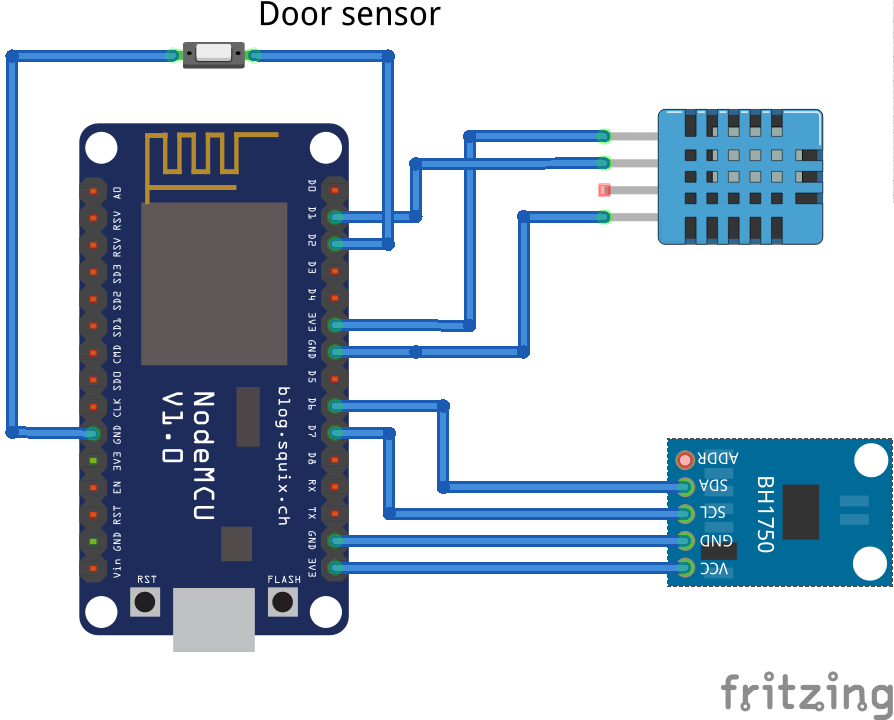

# Attic node

## Functionality
The attic node is basically a combination of the livingroom node and the attic node:
* It does not control any light with an IR emitter.
* It senses temperature, humidity and light, and monitors the state of the door.

## Implementation
As this node does not control any light, it does not have any “responsiveness” requirement, and therefore we can define a much lower polling frequency.
As the door interrupt works with interrupts and each interrupt will trigger the LOOP in the next loop() iteration, we can be sure that every time we interact with the attic by opening/closing the door, the latest sensor information will be available at the main node, regardless of the polling frequency we use.

## Known issues

## Future improvements

## Used hardware
* Nodemcu ESP12
* Door sensor: https://www.amazon.com/Gufastore-Surface-Magnetic-Contact-Security/dp/B07DBP7QLT?ref_=fsclp_pl_dp_13
* DHT11
* BH1750

## External libraries used
* PubSubClient: https://pubsubclient.knolleary.net
* Arduino DHT library: https://learn.adafruit.com/dht
* BH1750 library: https://github.com/claws/BH1750

## Schematic

