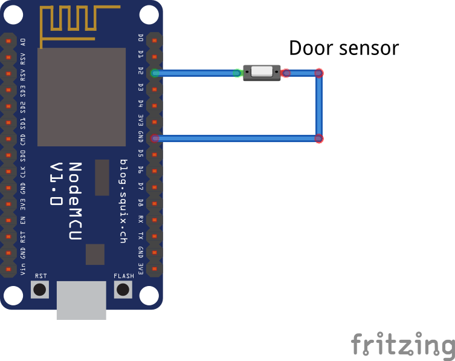

# Balcony node

This node is deprecated and no longer used in the v2.0 version.
The Livingroom and Terrace nodes take over its functionality.

## Functionality
This node detects when the door of the balcony is opened and closed.
It can be considered as a simplification of the “Entrance Node”.

## Implementation
The door sensor works very good with interrupts (no bouncing effects seen), and as we only need to publish the door information when its status changes, we can avoid any polling cycle and implement it only with interrupts.
We will put the microcontroller in Light Sleep mode for a period of 5s at every loop iteration.
The interrupt will still be handled, but we can't exit the sleep period once we are in it. Therefore, depending on when the interrupt happens, there can be a delay of up to 5s between the interrupt and publishing the event.
The usage of the information published by this node is not time critical, and therefore a 5s delay is acceptable.

## Known issues and future improvements

## Used hardware
* Nodemcu ESP12
* Door sensor: https://www.amazon.com/Gufastore-Surface-Magnetic-Contact-Security/dp/B07DBP7QLT?ref_=fsclp_pl_dp_13

## External libraries used
* PubSubClient: https://pubsubclient.knolleary.net

## Schematic

