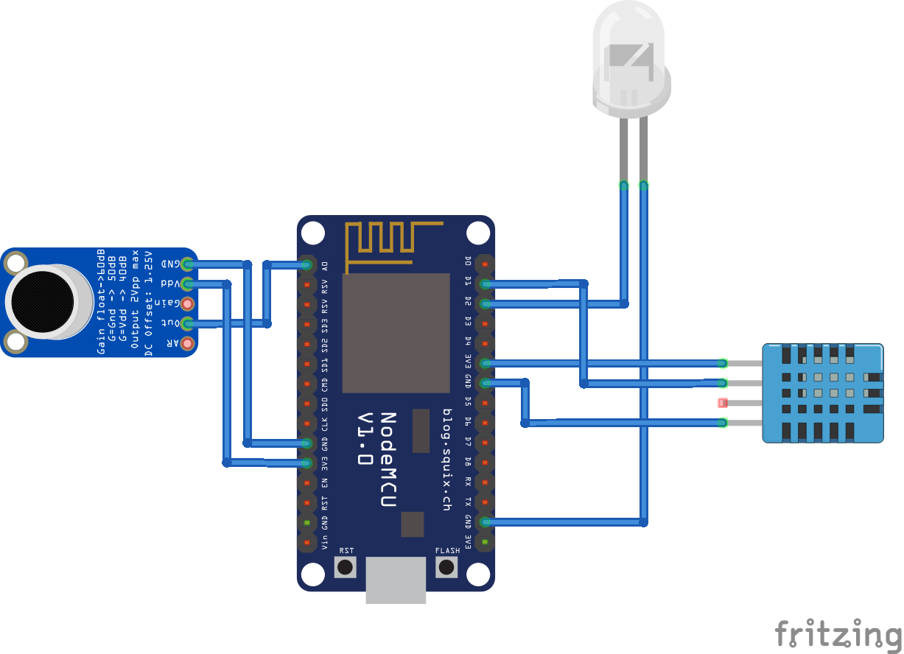

# Bedroom node

## Functionality
The bedroom node is very similar to the livingroom node. With two main differences:
* It does not measure light amount.
* It adds a feature to control a LED stripe by clapping:
  * Twice, to switch ON/OFF
  * Three times, to change the light effect.

Here I will only cover these two differences.

The node supports OTA software updates, under the URL "http://bedroom_node.local/"

## Implementation
“Switch-by-clap” feature:  to implement this feature, I reused some old code from an audio equalizer. I just cared about filtering as much noise as possible and at the same time doing the processing as fast as possible, therefore the settings may not make much sense if you want to do proper audio digital signal processing, but works for this use case.

For each loop iteration, 64 audio samples are taken with a sampling frequency of 200kHz. This signal is processed in time and frequency (FFT) to decide whether within that time, a clap has been detected. A single clap is considered to be detected if the following conditions are met:
* The sampled signal (in time) has a maximum value larger 80% of the maximum input value of the ADC (1024). This value has been empirically chosen. It is difficult to reach with random house sounds, but you don't need to destroy your hands to clap so loud.
* The largest frequency contribution of the sampled signal does not lie within the lowest 15% nor the highest 15% of the sampled spectrum. This is approximately the spectrum where (most of) the measured claps showed to have more contribution. By this way we filter non-clap-related noise. The more users with different "clapping styles", the wider the spectrum has to be.

The trigger for a lamp state switch (double clap) is considered to be detected if the following conditions are met:
* A first clap is detected after a period of more than 1 second without detecting any clap.
* A second clap is detected in a period of [80-800] milliseconds after the first clap.
* No third clap is detected in a period of [80-1500] milliseconds after the second clap.

## Known issues
* Any sound with a level above the defined threshold, with highest contribution in the expected spectrum, and meeting the timing conditions of the detection, will of course trigger the state change of the lights. In some cases, loud music or even a heavy object falling down and bouncing might trigger the detection.
* This has been calibrated for my “claps”, my microphone and my room. Different context might need further calibration of the algorithm (e.g: room with echo, different mic…).

## Future improvements

## Used hardware
* ESP32
* DH22
* MAX9814
* WS2812

## External libraries used
* PubSubClient: https://pubsubclient.knolleary.net
* Arduino DHT library: https://learn.adafruit.com/dht
* WebSocketsClient: https://github.com/Links2004/arduinoWebSockets
* ArduinoJson: https://github.com/bblanchon/ArduinoJson
* FastLED: https://github.com/FastLED/FastLED

## Schematic

