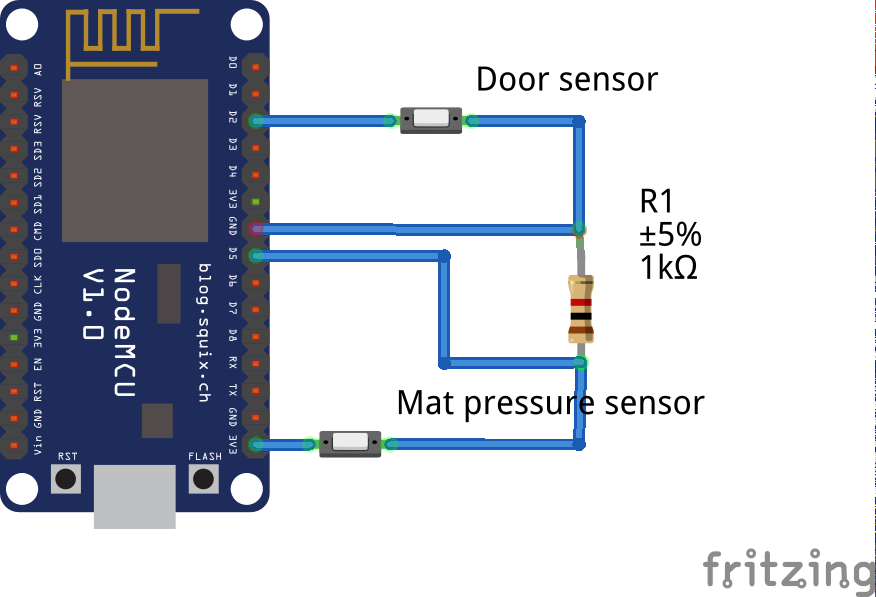

# Entrance node

## Functionality
This node is responsible for detecting when somebody enters or leaves the apartment. This information can be extremely useful for automation tasks.

This detection will be done with the combination of two sensors:
* Door sensor: detects when the state of the door changes (open/close).
* Mat pressure sensor: detects when somebody is standing on it.

With a change in the door sensor and the historic information of the pressure sensor, we can distinguish between events:
* If the door gets opened and there was no previous pressure detected: EXIT event.
* If the door gets opened and there was a previous pressure detected: ENTRANCE event.

This works fine in a theoretical world, but in the real world, some “tuning” and special cases must be considered:
* Find the maximum time between a pressure detected and an open door event to detect an entrance.
* Avoid a false entrance detection when leaving, in the situations when the door is opened (exit detected), then the mat pressure is activated (as expected) and then, when closing the door, it bounces enough to trigger a door opened event. In this situation, the events 1 and 2 will trigger an exit event, and the events 2 and 3 will trigger an entrance event.

It supports OTA software updates, under the URL "http://entrance_node.local".

## Implementation
As these events are sporadic, so the logical way to implement them is using interrupts.
Unfortunately the pressure sensor works horribly with interrupts. I tried debouncing with software (several pollings after the interrupt) and hardware (RC filter), but it kept triggering many interrupts, and even interacting with other parts of the software it was not supposed to (probably wrong cabling, or I messed up somehow else). The only way I could make it work stable is getting rid of the interrupts for this node and polling it directly with a high frequency.
The pressure sensor is polled every 500ms. This is enough to detect presence on the mat without noticing that it is implemented with polling instead of interrupts.
Once an event is detected and published (e.g: door status, pressure, entrance, exit), the software will prevent that the same event is sent again in the next 20 seconds. By this way we avoid sending duplicated events, overloading the network and confusing the subscriptors to these topics.

## Known issues and future improvements
* Interrupt issue with mat pressure sensor: this sensor does not work reliable with interrupts (cabling, electronics...). Reading the state by polling solves the problem.

## Used hardware
* Nodemcu ESP12
* Door sensor: https://www.amazon.com/Gufastore-Surface-Magnetic-Contact-Security/dp/B07DBP7QLT?ref_=fsclp_pl_dp_13
* Mat pressure sensor: https://www.amazon.com/Ideal-Security-Pressure-Pleasant-Triggered/dp/B00GUNX7WY/ref=sr_1_1?keywords=mat+pressure+sensor&qid=1550679188&s=gateway&sr=8-1

## External libraries used
* PubSubClient: https://pubsubclient.knolleary.net

## Schematic

