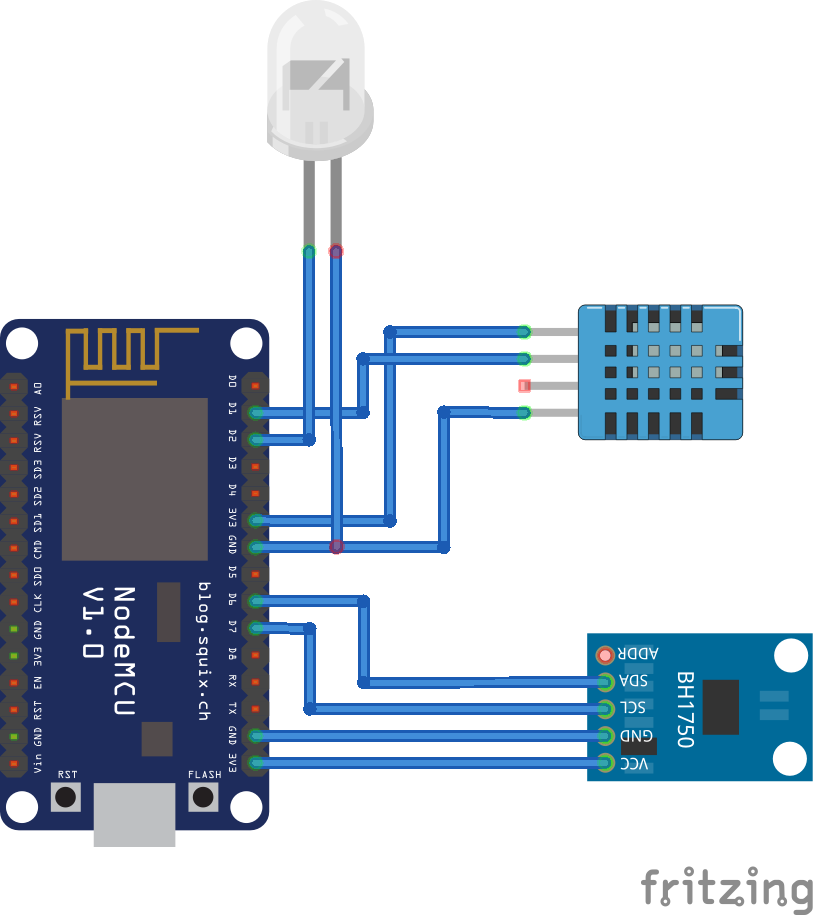

# Livingroom node

## Functionality
This node is responsible for sensing the temperature, humidity and light amount in the living room.
This node is also responsible for controlling a LED lamp (just 2 standard RGB led bulbs that are controlled with an IR remote).
The interaction with the lamp can be done in two different ways:
* From our MQTT network (automation and dashboard).
* With Alexa (using Sinric).

As two different sources can change the state of the lamp, the information that we see in our Dashboard may not be consistent.
To avoid consistency problems, whenever the state of the lamp is changed (from either source), the change will be published, allowing the Dashboard (or any other logic) to be updated with the real state of the lamp.

The node also publishes a message when it boots and when it reconnects to the MQTT broker, for debugging purposes.

## Implementation
There are many tutorials explaining how to emulate a smart light with ESP8266 to control it with Alexa. Therefore, I will not cover this in this explanation., Example: https://maker.pro/esp8266/projects/alexa-smart-home-using-node-mcu

The node-specific functionality (including publish information) is executed periodically.
The temperature & humidity sensor can only be polled once in a second (otherwise we get weird NaN measurements), so this would be our bottleneck for the polling frequency of this node.
On the other hand, as we are controlling a lamp, we want it to be responsive, so we don't need to wait until the next polling iteration to see the change in the lamp.
To implement both functionalities with as few code as possible, we enter the node-specific loop (polling, logic and publish) if any of these conditions are met:
* Time between iterations happened (polling period).
* A light change request (Alexa/MQTT) has been received.

Due to our code simplification, a light change request also triggers the full node-specific loop, including polling the sensors. If this request happens right after the periodic execution of the node-specific loop, we might have polled to quickly the DHT11 sensor, receiving a NaN as output.
This is no issue because this situation will not happen often, and the sensor signal is filtered as we can see next.

The sensors used in this node are very sensible to any disturbance or wrong wiring, resulting to a NaN return. Working with NaN values or see them displayed in the Dashboard is a little bit ugly, and therefore each node that uses these sensors implements a signal smoothing algorithm that buffers the N latest measurements, discards the M NaN measurements out of the buffer and then averages the N-M remaining values, smoothing the published sensor information and ignoring sporadic measurement errors.

For mapping a received event (e.g: Light ON, Color RED...) to an IR command, I did the following:
* Load a basic IR sniffer sketch to an arduino with an IR receiver.
* Figure out the IR protocol used (also a feature of the IR sniffer).
* Check the IR code sent by the IR remote for each button.
* For color commands, map each command to a range of RGB values.

Be aware that different RGB led bulbs might use different commands and protocols. If this is the case, you would need to repeat the steps above for your bulbs.

## Known issues
* The communication with Alexa through Sinric is not 100% stable, and sometimes it crashes. If this happens and until it reconnects, a request might have been lost.
* The mapping of RGB colors to IR commands is far away from being perfect, and it might happen that the color you request and the one you see, have nothing to do with each other. The closer your color is to the pure colors (Red, Green, Blue), the better the mapping will be.

## Future improvements
* In future versions, this node will move towards controlling a LED stripe (WS2812B) directly instead of controlling an IR bulb.

## Used hardware
* Nodemcu ESP12
* DH11
* BH1750
* IR emitter

## External libraries used
* PubSubClient: https://pubsubclient.knolleary.net
* Arduino DHT library: https://learn.adafruit.com/dht
* WebSocketsClient: https://github.com/Links2004/arduinoWebSockets
* ArduinoJson: https://github.com/bblanchon/ArduinoJson
* IRsender: https://github.com/markszabo/IRremoteESP8266/
* BH1750 library: https://github.com/claws/BH1750

## Schematic

